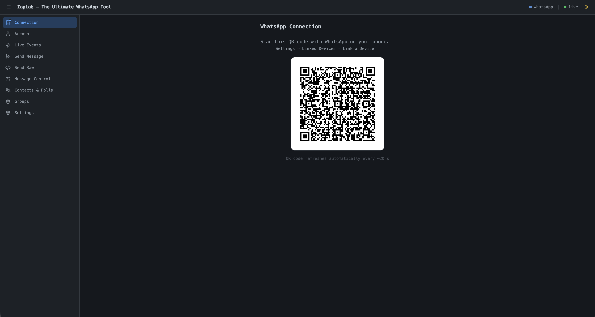
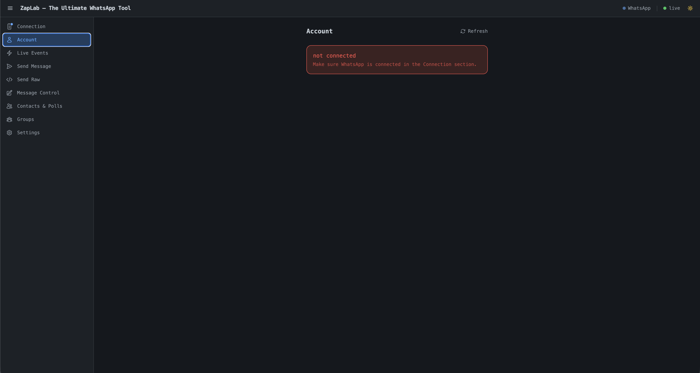
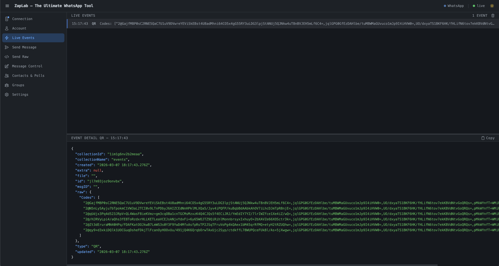
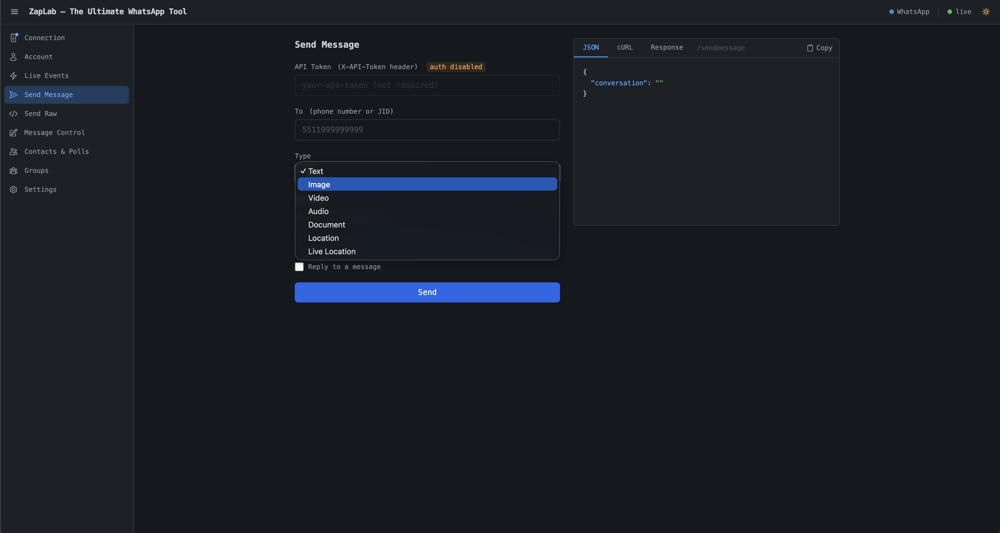
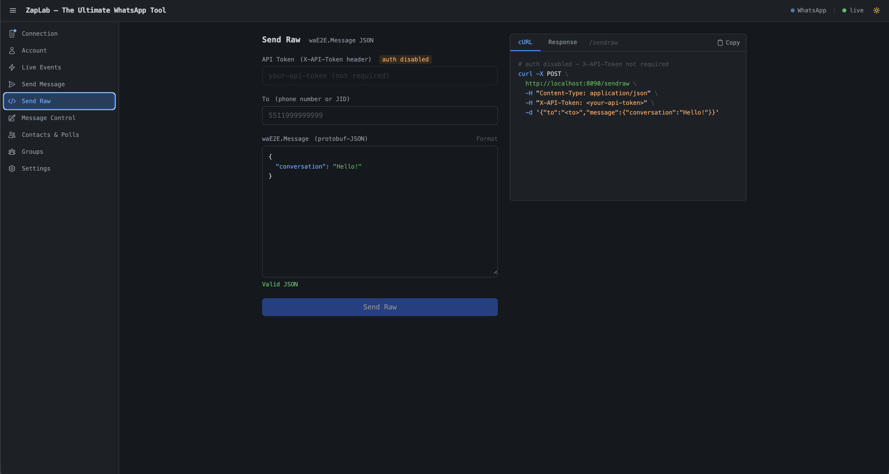
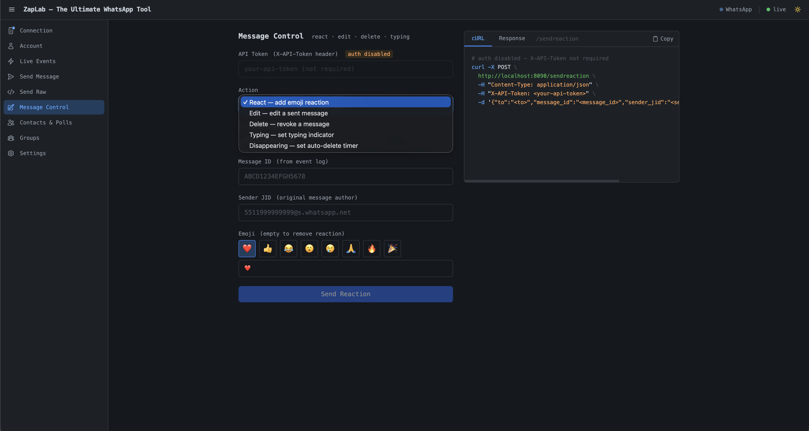
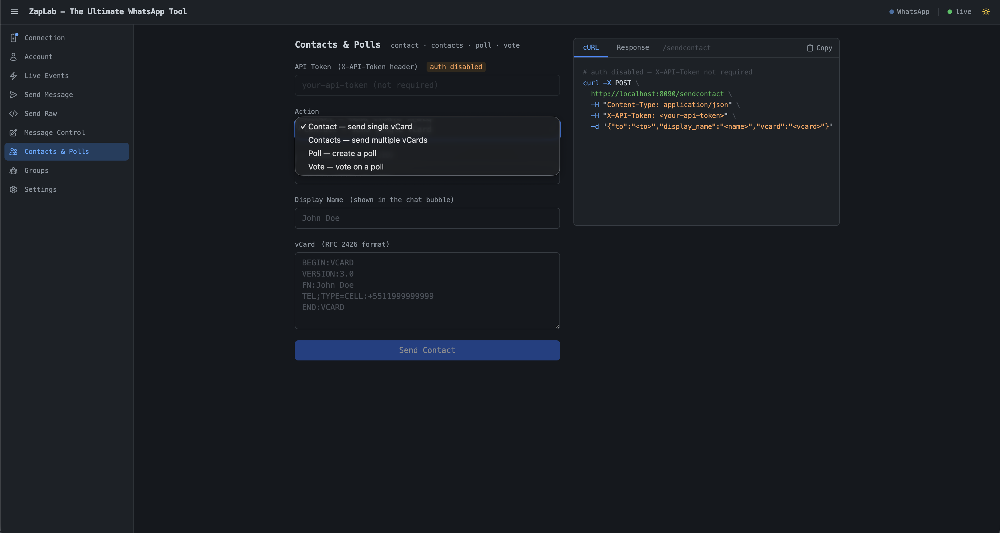
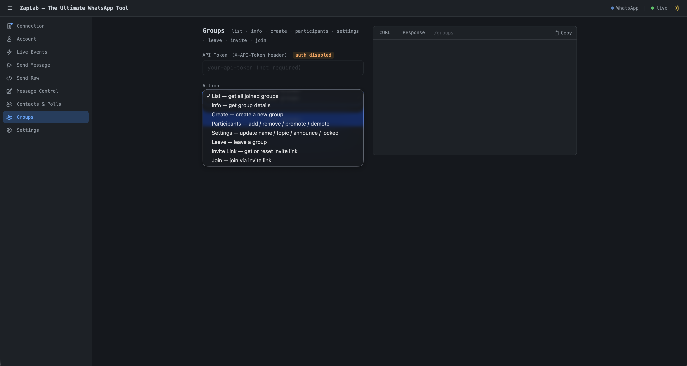
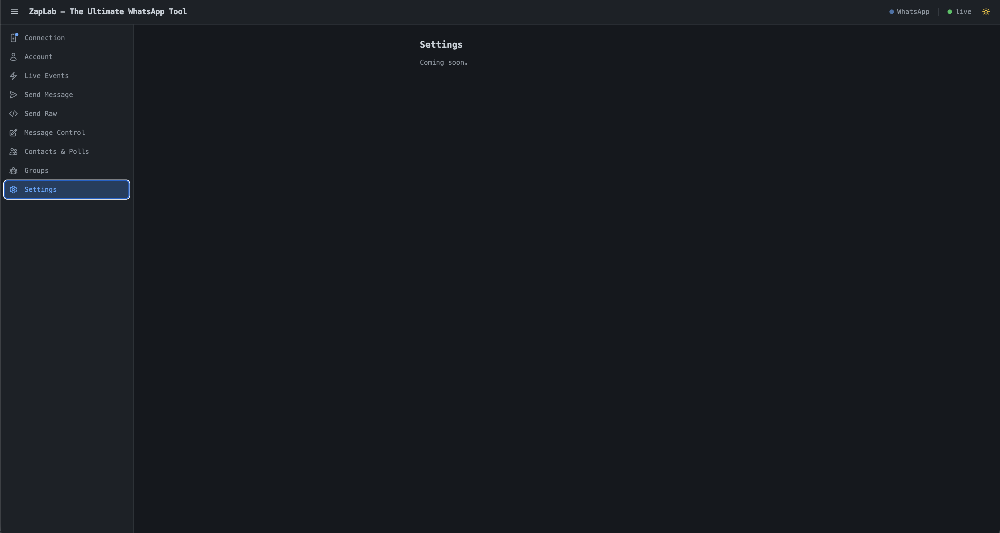

# zaplab — The Ultimate WhatsApp Tool

> **English version:** [README.md](./README.md)

Toolkit em Go para estudo e teste do protocolo WhatsApp Web, com uma API REST embutida para integrações (n8n, webhooks e mais). Todos os eventos (mensagens recebidas, recibos, presença, histórico, erros de envio) são persistidos no PocketBase (SQLite) e despachados para webhooks configuráveis. Mensagens podem ser enviadas via API REST.

---

## Início Rápido

```bash
# 1. Clonar e compilar
git clone https://github.com/lichti/zaplab.git
cd zaplab
cp .env.example .env          # defina API_TOKEN (obrigatório)
make build                    # requer Go 1.25+

# 2. Executar (binário local)
make run                      # inicia em http://localhost:8090

# OU executar com Docker
make run-docker               # stack completa (engine + n8n + cloudflared)
```

```bash
# 3. Parear o WhatsApp — escaneie o QR code exibido nos logs
make logs                     # aguarde o QR code no terminal
# No celular: Configurações → Aparelhos conectados → Conectar aparelho

# 4. Abrir o dashboard
open http://localhost:8090    # redireciona para /zaplab/tools/
# Login padrão: zaplab@zaplab.local / <senha exibida na primeira inicialização>

# 5. Verificar a conexão
curl http://localhost:8090/health
# {"pocketbase":"ok","whatsapp":true}
```

> A sessão é persistida em `data/db/whatsapp.db`. Nas próximas inicializações o bot reconecta automaticamente — sem QR code.

---

## Sumário

- [Início Rápido](#início-rápido)
- [Visão geral](#visão-geral)
- [Arquitetura](#arquitetura)
- [Estrutura do projeto](#estrutura-do-projeto)
- [Requisitos](#requisitos)
- [Build local](#build-local)
- [Execução local](#execução-local)
- [Docker](#docker)
- [Primeiro uso — pareamento WhatsApp](#primeiro-uso--pareamento-whatsapp)
- [Atualizando](#atualizando)
- [Versionamento](#versionamento)
- [Variáveis de ambiente](#variáveis-de-ambiente)
- [Flags do binário](#flags-do-binário)
- [API REST](#api-rest)
- [Sistema de webhooks](#sistema-de-webhooks)
- [Comandos via WhatsApp](#comandos-via-whatsapp)
- [Modelo de dados (PocketBase)](#modelo-de-dados-pocketbase)
- [Frontend — ZapLab UI](#frontend--zaplab-ui)
- [Admin UI](#admin-ui)
- [Portas](#portas)

---

## Visão geral

**Tecnologias principais:**

| Componente | Biblioteca / Serviço |
|---|---|
| Protocolo WhatsApp | [whatsmeow](https://github.com/tulir/whatsmeow) |
| Backend / banco / admin | [PocketBase](https://pocketbase.io/) v0.36 |
| HTTP router | PocketBase built-in (stdlib `net/http`) |
| Automação de workflows | [n8n](https://n8n.io/) (opcional, porta 5678) |
| Exposição segura | Cloudflare Tunnel (opcional) |

---

## Arquitetura

```
┌─────────────────────────────────────────────┐
│                  main package                │
│  (flags, PocketBase hooks, wiring)           │
└────────┬────────────┬────────────┬───────────┘
         │            │            │
         ▼            ▼            ▼
┌──────────────┐ ┌──────────┐ ┌────────────────┐
│internal/     │ │internal/ │ │internal/       │
│webhook       │ │whatsapp  │ │api             │
│              │ │          │ │                │
│Config        │ │Bootstrap │ │RegisterRoutes  │
│SendToDefault │ │handler   │ │POST /sendmsg   │
│SendToError   │ │HandleCmd │ │POST /cmd       │
│SendToCmd     │ │ParseJID  │ │GET  /health    │
│AddCmdWebhook │ │Send*     │ │...             │
│...           │ │persist   │ │                │
└──────────────┘ └──────────┘ └────────────────┘
         │            │
         ▼            ▼
  webhook.json   PocketBase SQLite
  (data/)        (data/db/)
```

**Fluxo de lifecycle (PocketBase hooks):**

```
pb.Start()
  → OnBootstrap (envolve o core):
      1. carrega webhook.json + Init() dos pacotes
      2. e.Next() → bootstrap do core (DB, migrations, cache, settings)
      3. Bootstrap() — conecta ao WhatsApp
  → OnServe (envolve o serve):
      1. registra rota /* (arquivos estáticos)
      2. RegisterRoutes() — API REST
      3. e.Next() → inicia servidor HTTP
```

---

## Estrutura do projeto

```
.
├── main.go                         # Entry point
├── app.go                          # Struct App (estado compartilhado do main)
├── go.mod / go.sum
├── migrations/                     # Migrations PocketBase (auto-aplicadas)
├── internal/
│   ├── webhook/
│   │   └── webhook.go              # Configuração e envio de webhooks
│   ├── whatsapp/
│   │   ├── deps.go                 # Vars de pacote + Init()
│   │   ├── types.go                # Payloads internos
│   │   ├── bootstrap.go            # Bootstrap() — conexão WhatsApp
│   │   ├── events.go               # handler() — todos os eventos WA
│   │   ├── commands.go             # HandleCmd() + cmdXxx()
│   │   ├── send.go                 # Send*() — envio de mensagens
│   │   ├── groups.go               # Funções de gerenciamento de grupos
│   │   ├── spoof.go                # Mensagens spoofadas/editadas
│   │   ├── helpers.go              # ParseJID, download, getTypeOf
│   │   └── persist.go              # saveEvent, saveError, saveEventFile
│   └── api/
│       └── api.go                  # API REST (handlers HTTP)
├── pb_public/                      # Frontend ZapLab (servido em /tools/)
│   ├── index.html                  # Estrutura HTML (~1 700 linhas, sem JS/CSS inline)
│   ├── css/
│   │   └── zaplab.css              # Estilos customizados (syntax highlight, scrollbar, animações)
│   └── js/
│       ├── utils.js                # Helpers compartilhados (fmtTime, highlight, highlightCurl, …)
│       ├── zaplab.js               # Factory principal — une seções + estado compartilhado + init()
│       └── sections/
│           ├── pairing.js          # Connection — exibição do QR code, polling de status, logout
│           ├── account.js          # Account — foto de perfil, push name, about, plataforma
│           ├── events.js           # Live Events — assinatura realtime + redimensionador
│           ├── send.js             # Send Message — todos os tipos de mídia + reply_to
│           ├── sendraw.js          # Send Raw — editor JSON raw waE2E.Message
│           ├── ctrl.js             # Message Control — react/edit/delete/typing/disappearing
│           ├── contacts.js         # Contacts & Polls — vCard / criar poll / votar
│           └── groups.js           # Group Management — list/info/create/participants/settings
├── bin/                            # Binários compilados (ignorado pelo git)
├── Makefile
├── Dockerfile
├── docker-compose.yml
├── entrypoint.sh
└── .env.example                    # Template de variáveis de ambiente
```

---

## Requisitos

**Build local:**
- Go 1.25+
- Nenhum CGO necessário — PocketBase v0.36 usa `modernc.org/sqlite` (Go puro)

**Docker:**
- Docker 24+
- Docker Compose v2

---

## Build local

```bash
# Formatar + vet + baixar deps + compilar
make build

# Criar symlink sem sufixo de plataforma (opcional)
make link
```

O binário gerado fica em `bin/`:
```
bin/zaplab_<GOOS>_<GOARCH>
# ex: bin/zaplab_linux_amd64
#     bin/zaplab_darwin_amd64
```

> O binário é auto-suficiente — todo o frontend `pb_public/` é embutido em tempo de compilação via `//go:embed`. Nenhum arquivo extra é necessário para executá-lo.
>
> Para desenvolvimento de frontend, defina `ZAPLAB_DEV=1` para servir os arquivos do disco e evitar recompilar a cada mudança na UI.

---

## Execução local

```bash
# Executar o binário já compilado (porta padrão 8090)
make run

# Equivalente manual:
./bin/zaplab serve --http 0.0.0.0:8090

# Com debug:
./bin/zaplab serve --http 0.0.0.0:8090 --debug

# Build + execução em um passo:
make build-run
```

Os dados são persistidos em `$HOME/.zaplab/` por padrão:

```
~/.zaplab/
├── pb_data/            # Banco PocketBase (events, errors, collections...)
├── db/
│   └── whatsapp.db     # Sessão WhatsApp (credenciais do dispositivo)
├── history/            # Dumps JSON de HistorySync
├── n8n/                # Dados de workflows do n8n
└── webhook.json        # Configuração de webhooks
```

Para alterar o diretório base:

```bash
# Via variável de ambiente (persistente):
export ZAPLAB_DATA_DIR=/caminho/personalizado
make run

# Via flag (execução única):
./bin/zaplab serve --data-dir /caminho/personalizado

# Via variável do Makefile:
make run DATA_DIR=/caminho/personalizado
```

Caminhos individuais podem ser sobrescritos de forma independente:

```bash
./bin/zaplab serve \
  --data-dir /base/path \
  --whatsapp-db-address "file:/outro/path/whatsapp.db?_foreign_keys=on" \
  --webhook-config-file /etc/zaplab/webhook.json
```

---

## Docker

### Build da imagem

```bash
make build-img
```

### Subir a stack completa

```bash
make run-docker     # docker compose up -d
make logs           # acompanhar logs (necessário para capturar QR code)
make ps             # status dos containers
make down           # parar
make clean-docker   # parar + remover volumes, imagens e orphans
```

### Acessar shell dos containers

```bash
make shell
```

### Serviços no docker-compose.yml

| Serviço | Imagem | Porta | Descrição |
|---|---|---|---|
| `engine` | build local | 8090 | Bot + PocketBase |
| `n8n` | n8nio/n8n | 5678 | Automação de workflows |
| `cloudflared` | cloudflare/cloudflared | — | Tunnel para exposição pública |

---

## Primeiro uso — pareamento WhatsApp

### Passo 1 — Configurar ambiente

Copie `.env.example` para `.env` e preencha seus tokens:

```bash
cp .env.example .env
# Edite .env e defina:
#   API_TOKEN=seu-token-secreto
#   TUNNEL_TOKEN=seu-token-cloudflare  (se usar cloudflared)
```

### Passo 2 — Subir a stack

```bash
make run-docker
```

### Passo 3 — Parear o WhatsApp

Na primeira execução o bot não tem sessão, então imprime um QR code no log:

```bash
make logs
```

O terminal exibirá algo como:

```
█████████████████████████
█ ▄▄▄▄▄ █▀▀  ▄█ ▄▄▄▄▄ █
█ █   █ █▄▀▄▀▀█ █   █ █
...
INFO  Client connected
INFO  Client logged in
```

No WhatsApp do celular: **Configurações → Aparelhos conectados → Conectar aparelho** e escanear o QR code.

### Passo 4 — Criar superusuário PocketBase

Abra `http://localhost:8090/_/` e siga o assistente para criar a primeira conta de administrador.

### Passo 5 — Verificar

```bash
curl http://localhost:8090/health
# {"pocketbase":"ok","whatsapp":true}
```

> A sessão é persistida em `data/db/whatsapp.db`. Nas próximas execuções o bot reconecta automaticamente — sem QR code.

---

## Atualizando

### Atualização do binário local

```bash
git pull
make build
make run
```

### Atualização via Docker

```bash
git pull
make down
make build-img
make run-docker
make logs
```

> A sessão do WhatsApp e os dados do PocketBase ficam em `data/` (volume montado), e sobrevivem ao rebuild da imagem.

### Após uma nova migration de schema

As migrations novas rodam automaticamente na inicialização via `migratecmd.MustRegister`. Nenhuma ação manual é necessária.

```bash
# Você pode verificar as migrations aplicadas na Admin UI:
# http://localhost:8090/_/ → Settings → Migrations
```

### Desconectar / re-parear o WhatsApp

```bash
# Apaga a sessão WhatsApp (apenas credenciais — NÃO apaga dados do PocketBase):
rm ~/.zaplab/db/whatsapp.db   # ajuste o path se usar ZAPLAB_DATA_DIR customizado

make run-docker
make logs   # escanear QR code novamente
```

---

## Versionamento

As releases seguem [Semantic Versioning](https://semver.org/): `vMAJOR.MINOR.PATCH[-prerelease]`
Exemplos: `v1.0.0-beta.1`, `v1.0.0-rc.1`, `v1.0.0`, `v1.1.0`

A versão é embutida no binário em tempo de build a partir da tag git mais próxima via `-ldflags`.

```bash
# Verificar a versão do binário compilado
./bin/zaplab version

# Criar e publicar uma nova tag de release
make tag TAG=v1.0.0-beta.1
git push origin v1.0.0-beta.1
```

| Situação | String de versão |
|---|---|
| Sem tag git | `dev` |
| Exatamente na tag `v1.0.0` | `v1.0.0` |
| 3 commits após a tag | `v1.0.0-3-gabc1234` |
| Com alterações não commitadas | `v1.0.0-dirty` |

---

## Variáveis de ambiente

| Variável | Obrigatório | Descrição |
|---|---|---|
| `ZAPLAB_DATA_DIR` | Não | Diretório base para todos os dados em runtime. Padrão: `$HOME/.zaplab`. Pode ser sobrescrito com `--data-dir`. |
| `API_TOKEN` | Sim | Token para autenticar chamadas de API REST externas. Se não definido, a autenticação por token estático é desativada. |
| `TUNNEL_TOKEN` | Não | Token do Cloudflare Tunnel (apenas se usar `cloudflared`). |
| `ZAPLAB_DEV` | Não | Defina como `1` para servir o frontend a partir de `./pb_public/` no disco em vez da cópia embutida (habilita hot-reload durante o desenvolvimento do frontend). |

---

## Flags do binário

Além das flags padrão do PocketBase (`serve`, `--http`, `--dir`, etc.), o binário aceita:

| Flag | Padrão | Descrição |
|---|---|---|
| `--data-dir` | `$ZAPLAB_DATA_DIR` ou `$HOME/.zaplab` | Diretório base para todos os dados em runtime |
| `--debug` | `false` | Habilita logs de nível DEBUG |
| `--whatsapp-db-dialect` | `sqlite3` | Dialeto do banco WhatsApp (`sqlite3` ou `postgres`) |
| `--whatsapp-db-address` | `<data-dir>/db/whatsapp.db` | DSN do banco WhatsApp |
| `--whatsapp-request-full-sync` | `false` | Solicita histórico completo (10 anos) no primeiro login |
| `--whatsapp-history-path` | `<data-dir>/history` | Diretório para dumps JSON de HistorySync |
| `--webhook-config-file` | `<data-dir>/webhook.json` | Caminho do arquivo de configuração de webhooks |
| `--device-spoof` | `companion` | Identidade do dispositivo apresentada ao WhatsApp: `companion` (padrão), `android`, `ios` — ⚠️ **Em desenvolvimento**, experimental, re-parear após alterar |

> A flag `--dir` do PocketBase (localização do pb_data) também usa `<data-dir>/pb_data` como padrão.

**Exemplo:**
```bash
./bin/zaplab serve \
  --http 0.0.0.0:8090 \
  --data-dir /srv/zaplab \
  --debug
```

---

## API REST

> Referência completa da API: [`specs/API_SPEC.md`](./specs/API_SPEC.md)

Todas as rotas (exceto `/health`) exigem o header:

```
X-API-Token: <valor de API_TOKEN>
```

### `GET /health`

Verifica se o servidor e a conexão WhatsApp estão ativos. Não requer autenticação.

```json
// 200 OK
{ "pocketbase": "ok", "whatsapp": true }

// 503 Service Unavailable (WhatsApp desconectado)
{ "pocketbase": "ok", "whatsapp": false }
```

### `GET /ping`

```json
{ "message": "Pong!" }
```

### `GET /wa/status`

Retorna o estado atual da conexão WhatsApp e o JID do telefone pareado. Não requer autenticação.

```json
{ "status": "connected", "jid": "5511999999999@s.whatsapp.net" }
```

| Valor de `status` | Significado |
|---|---|
| `connecting` | Cliente conectando aos servidores WhatsApp |
| `qr` | Aguardando leitura do QR code — buscar `/wa/qrcode` |
| `connected` | Pareado e online |
| `disconnected` | Conexão perdida, reconexão em andamento |
| `timeout` | QR code expirou, novo código a caminho |
| `loggedout` | Sessão encerrada, reinicie para parear novo dispositivo |

### `GET /wa/qrcode`

Retorna o QR code atual como data URI PNG em base64. Disponível apenas quando `status` é `qr`.

```json
{ "status": "qr", "image": "data:image/png;base64,..." }
```

Retorna `404` se nenhum QR code estiver disponível.

### `POST /wa/logout`

Encerra a sessão e limpa o dispositivo WhatsApp. É necessário reiniciar o servidor para parear um novo dispositivo.

```json
{ "message": "logged out" }
```

### `GET /wa/account`

Retorna os detalhes da conta conectada, obtidos do store local e dos servidores WhatsApp.

```json
{
  "jid":           "5511999999999@s.whatsapp.net",
  "phone":         "5511999999999",
  "push_name":     "João Silva",
  "business_name": "",
  "platform":      "android",
  "status":        "Disponível",
  "avatar_url":    "https://mmg.whatsapp.net/..."
}
```

Retorna `503` quando o WhatsApp não está conectado. `avatar_url` fica vazio se a conta não tiver foto de perfil.

### `POST /sendmessage`

Envia uma mensagem de texto.

```json
// Request
{
  "to": "5511999999999",
  "message": "Olá!"
}

// Response 200
{ "message": "Message sent" }
```

O campo `to` aceita:
- Número com DDD: `"5511999999999"`
- Número com `+`: `"+5511999999999"`
- JID completo: `"5511999999999@s.whatsapp.net"`
- JID de grupo: `"123456789@g.us"`

### `POST /sendimage`

Envia uma imagem. O campo `image` deve estar em **Base64**.

```json
{
  "to": "5511999999999",
  "message": "Legenda opcional",
  "image": "<base64>"
}
```

### `POST /sendvideo`

```json
{
  "to": "5511999999999",
  "message": "Legenda opcional",
  "video": "<base64>"
}
```

### `POST /sendaudio`

```json
{
  "to": "5511999999999",
  "audio": "<base64>",
  "ptt": true
}
```

`ptt: true` envia como mensagem de voz (push-to-talk). `ptt: false` envia como arquivo de áudio.

### `POST /senddocument`

```json
{
  "to": "5511999999999",
  "message": "Descrição opcional",
  "document": "<base64>"
}
```

> Limite de tamanho para mídia: **50 MB** por requisição.

### `POST /sendraw`

Envia qualquer `waE2E.Message` JSON diretamente — interface principal para exploração do protocolo WhatsApp.
O campo `message` é decodificado via `protojson.Unmarshal` em `*waE2E.Message` e enviado sem modificações.

```json
{
  "to": "5511999999999",
  "message": { "conversation": "Olá via SendRaw!" }
}
```

Veja [`specs/SEND_RAW_SPEC.md`](./specs/SEND_RAW_SPEC.md) para exemplos e documentação completa.

### `POST /sendlocation`

Envia um pino de localização GPS estática.

```json
{ "to": "5511999999999", "latitude": -23.5505, "longitude": -46.6333, "name": "São Paulo", "address": "Av. Paulista, 1000" }
```

### `POST /sendelivelocation`

Envia uma atualização de localização GPS ao vivo. Repita com `sequence_number` incrementado para atualizar a posição.

```json
{ "to": "5511999999999", "latitude": -23.5505, "longitude": -46.6333, "accuracy_in_meters": 10, "caption": "A caminho do escritório", "sequence_number": 1 }
```

### `POST /setdisappearing`

Define o temporizador de auto-exclusão para uma conversa ou grupo. `timer`: `0` (desligar), `86400` (24h), `604800` (7d), `7776000` (90d).

```json
{ "to": "5511999999999", "timer": 86400 }
```

### Suporte a reply — campo `reply_to`

Todos os endpoints de envio aceitam um campo opcional `reply_to` para citar uma mensagem anterior:

```json
{
  "to": "5511999999999",
  "message": "Que ótimo!",
  "reply_to": { "message_id": "ABCD1234EFGH5678", "sender_jid": "5511999999999@s.whatsapp.net", "quoted_text": "Texto original" }
}
```

### `POST /sendreaction`

Adiciona ou remove uma reação de emoji em uma mensagem.

```json
{ "to": "5511999999999", "message_id": "ABCD1234EFGH5678", "sender_jid": "5511999999999@s.whatsapp.net", "emoji": "❤️" }
```

Passe `"emoji": ""` para remover uma reação existente.

### `POST /editmessage`

Edita uma mensagem de texto enviada anteriormente (apenas mensagens do próprio bot, em até ~20 minutos).

```json
{ "to": "5511999999999", "message_id": "ABCD1234EFGH5678", "new_text": "Texto atualizado" }
```

### `POST /revokemessage`

Apaga uma mensagem para todos. Admins de grupo podem revogar mensagens de outros membros.

```json
{ "to": "5511999999999", "message_id": "ABCD1234EFGH5678", "sender_jid": "5511999999999@s.whatsapp.net" }
```

### `POST /settyping`

Envia indicador de digitação ou gravação de voz. Chame novamente com `"state": "paused"` para parar.

```json
{ "to": "5511999999999", "state": "composing", "media": "text" }
```

`state`: `"composing"` | `"paused"` — `media`: `"text"` (digitando) | `"audio"` (gravando)

### `POST /sendcontact`

Envia um contato vCard único.

```json
{
  "to": "5511999999999",
  "display_name": "João Silva",
  "vcard": "BEGIN:VCARD\nVERSION:3.0\nFN:João Silva\nTEL;TYPE=CELL:+5511999999999\nEND:VCARD"
}
```

Opcionalmente inclua `"reply_to": { "message_id": "...", "sender_jid": "...", "quoted_text": "..." }`.

---

### `POST /sendcontacts`

Envia múltiplos contatos vCard em uma única bolha de mensagem.

```json
{
  "to": "5511999999999",
  "display_name": "2 contatos",
  "contacts": [
    { "name": "Alice", "vcard": "BEGIN:VCARD\nVERSION:3.0\nFN:Alice\nTEL:+5511111111111\nEND:VCARD" },
    { "name": "Bob",   "vcard": "BEGIN:VCARD\nVERSION:3.0\nFN:Bob\nTEL:+5522222222222\nEND:VCARD" }
  ]
}
```

---

### `POST /createpoll`

Cria uma enquete no WhatsApp. A chave de criptografia é gerenciada internamente.

```json
{
  "to": "5511999999999",
  "question": "Cor favorita?",
  "options": ["Azul", "Verde", "Vermelho"],
  "selectable_count": 1
}
```

`selectable_count`: `1` = escolha única, `0` = ilimitado (múltipla escolha).

---

### `POST /votepoll`

Registra um voto em uma enquete existente. `poll_message_id` e `poll_sender_jid` devem corresponder exatamente à enquete original.

```json
{
  "to": "5511999999999",
  "poll_message_id": "ABCD1234EFGH5678",
  "poll_sender_jid": "5511999999999@s.whatsapp.net",
  "selected_options": ["Azul"]
}
```

---

### `GET /groups`

Retorna todos os grupos dos quais o bot é membro.

```json
{ "groups": [ { "JID": "123456789-000@g.us", "Name": "Grupo", "Participants": [...] } ] }
```

### `GET /groups/{jid}`

Retorna informações detalhadas de um grupo. O JID deve ser URL-encoded (ex.: `123456789-000%40g.us`).

### `POST /groups`

Cria um novo grupo. O nome é limitado a 25 caracteres.

```json
{ "name": "Meu Grupo", "participants": ["5511999999999", "5511888888888"] }
```

### `POST /groups/{jid}/participants`

Adiciona, remove, promove ou rebaixa participantes.

```json
{ "action": "add", "participants": ["5511999999999"] }
```

`action`: `"add"` | `"remove"` | `"promote"` | `"demote"`

### `PATCH /groups/{jid}`

Atualiza configurações do grupo. Inclua apenas os campos que deseja alterar.

```json
{ "name": "Novo Nome", "topic": "Nova descrição", "announce": true, "locked": false }
```

### `POST /groups/{jid}/leave`

Faz o bot sair do grupo.

### `GET /groups/{jid}/invitelink`

Retorna o link de convite do grupo. Adicione `?reset=true` para revogar o atual e gerar um novo.

```json
{ "link": "https://chat.whatsapp.com/AbCdEf123456" }
```

### `POST /groups/join`

Entra em um grupo usando um link de convite ou código.

```json
{ "link": "https://chat.whatsapp.com/AbCdEf123456" }
```

---

### `GET /groups/{jid}/participants`

Retorna apenas a lista de participantes de um grupo (mais leve que `GET /groups/{jid}`).

```json
// Response
{
  "jid": "123456789-000@g.us",
  "participants": [
    { "jid": "5511999999999@s.whatsapp.net", "phone": "5511999999999", "is_admin": true, "is_super_admin": false }
  ]
}
```

---

### `POST /media/download`

Baixa e descriptografa um arquivo de mídia do WhatsApp. Retorna binário bruto (não JSON). Limite: **50 MB**.

```json
// Request
{
  "url":        "https://mmg.whatsapp.net/...",
  "media_key":  "<base64 da chave de mídia>",
  "media_type": "image"
}
```

`media_type`: `image` | `video` | `audio` | `document` | `sticker`

---

### `GET /contacts`

Retorna todos os contatos do armazenamento local do dispositivo WhatsApp.

```json
// Response
{ "contacts": [{ "JID": "...", "FullName": "João Silva", "PushName": "João", ... }], "count": 1 }
```

---

### `POST /contacts/check`

Verifica se números de telefone estão registrados no WhatsApp.

```json
// Request
{ "phones": ["5511999999999", "5522888888888"] }

// Response
{ "results": [{ "Query": "5511999999999", "JID": "5511999999999@s.whatsapp.net", "IsIn": true }], "count": 1 }
```

---

### `GET /contacts/{jid}`

Retorna informações armazenadas de um contato específico (JID deve estar URL-encoded).

```json
// Response
{ "JID": "5511999999999@s.whatsapp.net", "Found": true, "FullName": "João Silva", "PushName": "João", ... }
```

---

### `POST /spoof/reply`

Envia uma mensagem que parece responder a uma citação falsa de um remetente falsificado.

```json
// Request
{
  "to":          "5511999999999",
  "from_jid":    "5533777777777@s.whatsapp.net",
  "msg_id":      "",
  "quoted_text": "Isso nunca aconteceu",
  "text":        "Mas aconteceu sim!"
}
```

---

### `POST /spoof/reply-private`

Igual ao `/spoof/reply`, mas envia no chat privado (DM) do destinatário, independente do `to`.

---

### `POST /spoof/reply-img`

Resposta falsificada com um balão de imagem falsa atribuído ao `from_jid`. Limite: **50 MB**.

```json
// Request
{
  "to":          "5511999999999",
  "from_jid":    "5533777777777@s.whatsapp.net",
  "msg_id":      "",
  "image":       "<base64>",
  "quoted_text": "Legenda no balão falso",
  "text":        "Minha resposta"
}
```

---

### `POST /spoof/reply-location`

Resposta falsificada com um balão de localização atribuído ao `from_jid`.

```json
// Request
{ "to": "5511999999999", "from_jid": "5533777777777@s.whatsapp.net", "msg_id": "", "text": "Resposta" }
```

---

### `POST /spoof/timed`

Envia uma mensagem autodestrutiva (efêmera).

```json
// Request
{ "to": "5511999999999", "text": "Esta mensagem vai desaparecer" }
```

---

### `POST /spoof/demo`

Executa uma sequência de conversa falsificada pré-definida em segundo plano. Retorna imediatamente. Limite: **50 MB**.

```json
// Request
{
  "to":       "5511999999999",
  "from_jid": "5533777777777@s.whatsapp.net",
  "gender":   "boy",
  "language": "br",
  "image":    "<base64 — opcional>"
}

// Response (imediato)
{ "message": "Demo started (boy/br)" }
```

`gender`: `boy` | `girl` · `language`: `br` | `en`

---

### `POST /wa/qrtext`

Gera um QR Code PNG (base64) para qualquer texto.

```json
// Request
{ "text": "https://chat.whatsapp.com/AbCdEf123456" }

// Response
{ "image": "data:image/png;base64,..." }
```

---

### `POST /cmd`

Executa um comando de bot via API (equivale a digitar `/cmd <cmd> <args>` no WhatsApp).

```json
// Request
{
  "cmd": "set-default-webhook",
  "args": "https://meu-servidor.com/webhook"
}

// Response 200
{ "message": "<saída do comando>" }
```

---

## Sistema de webhooks

Eventos são despachados para URLs configuradas. A configuração é persistida em `webhook.json` (dentro do diretório de dados) e pode ser alterada em runtime via API REST ou pela seção **Webhooks** da UI — sem necessidade de reiniciar.

### Estrutura do payload

Todos os webhooks recebem um array JSON:

```json
[
  {
    "type": "Message.ImageMessage",
    "raw": { /* evento completo do whatsmeow */ },
    "extra": null
  }
]
```

### Tipos de webhook

| Tipo | Descrição |
|---|---|
| **Default** | Recebe **todos** os eventos, independentemente do tipo |
| **Error** | Recebe apenas erros de processamento (falhas de envio, download, etc.) |
| **Event-type** | Recebe eventos cujo tipo corresponda a um nome exato ou padrão wildcard (ex: `Message.*`) |
| **Text-pattern** | Recebe mensagens de texto cujo conteúdo corresponda a uma regra (`prefix`, `contains`, `exact`), com filtro opcional por remetente e distinção de maiúsculas/minúsculas |
| **Cmd** | Legado: recebe mensagens cujo primeiro token corresponda a um comando cadastrado |

Webhooks de event-type e text-pattern disparam **em adição** ao webhook padrão — ambos são executados de forma independente.

### API REST de webhooks

| Método | Endpoint | Descrição |
|---|---|---|
| `GET` | `/zaplab/api/webhook` | Retorna a configuração completa (todos os tipos) |
| `PUT` | `/zaplab/api/webhook/default` | Define URL do webhook padrão `{"url":"..."}` |
| `DELETE` | `/zaplab/api/webhook/default` | Remove webhook padrão |
| `PUT` | `/zaplab/api/webhook/error` | Define URL do webhook de erros `{"url":"..."}` |
| `DELETE` | `/zaplab/api/webhook/error` | Remove webhook de erros |
| `GET` | `/zaplab/api/webhook/events` | Lista webhooks por tipo de evento |
| `POST` | `/zaplab/api/webhook/events` | Adiciona/atualiza `{"event_type":"Message.*","url":"..."}` |
| `DELETE` | `/zaplab/api/webhook/events` | Remove `{"event_type":"..."}` |
| `GET` | `/zaplab/api/webhook/text` | Lista webhooks por padrão de texto |
| `POST` | `/zaplab/api/webhook/text` | Adiciona webhook por padrão de texto (ver campos abaixo) |
| `DELETE` | `/zaplab/api/webhook/text` | Remove `{"id":"..."}` |
| `POST` | `/zaplab/api/webhook/test` | Envia payload de teste `{"url":"..."}` |

#### Campos do webhook por padrão de texto

| Campo | Valores | Descrição |
|---|---|---|
| `match_type` | `prefix` \| `contains` \| `exact` | Tipo de correspondência |
| `pattern` | qualquer string | O texto a buscar (ex: `/ping`, `pedido`, `olá mundo`) |
| `from` | `all` \| `me` \| `others` | Filtro por remetente: eu, contatos ou ambos |
| `case_sensitive` | `true` \| `false` | Padrão `false` (sem distinção de maiúsculas) |
| `url` | URL | URL de destino do webhook |

```bash
# Webhook disparado quando uma mensagem de outro contato começa com "/ping"
curl -X POST http://localhost:8090/zaplab/api/webhook/text \
  -H "Content-Type: application/json" \
  -d '{"match_type":"prefix","pattern":"/ping","from":"others","case_sensitive":false,"url":"https://meu-servidor.com/ping"}'
```

### Configurar via comandos WhatsApp (legado)

```
/cmd set-default-webhook https://meu-servidor.com/webhook
/cmd set-error-webhook   https://meu-servidor.com/errors
/cmd add-cmd-webhook     /pedido|https://meu-servidor.com/pedidos
/cmd rm-cmd-webhook      /pedido
/cmd print-cmd-webhooks-config
```

### Estrutura do `webhook.json`

```json
{
  "default_webhook": { "Scheme": "https", "Host": "meu-servidor.com", "Path": "/webhook" },
  "error_webhook":   { "Scheme": "https", "Host": "meu-servidor.com", "Path": "/errors" },
  "event_webhooks": [
    { "event_type": "Message.*", "webhook": { "Scheme": "https", "Host": "meu-servidor.com", "Path": "/mensagens" } }
  ],
  "text_webhooks": [
    { "id": "a1b2c3d4", "match_type": "prefix", "pattern": "/ping", "from": "others", "case_sensitive": false, "webhook": { "Scheme": "https", "Host": "meu-servidor.com", "Path": "/ping" } }
  ],
  "webhook_config": []
}
```

> O arquivo é reescrito automaticamente a cada alteração. Não é necessário reiniciar.

---

## Comandos via WhatsApp

Os comandos são digitados **na conversa privada do próprio bot** (chat consigo mesmo).

### Comandos internos

| Comando | Descrição |
|---|---|
| `<getIDSecret>` | Retorna o `ChatID` da conversa atual (o secret é gerado aleatoriamente no boot) |
| `/setSecrete <valor>` | Redefine o secret do getIDSecret |
| `/resetSecrete` | Gera um novo secret aleatório |
| `/cmd <comando> [args]` | Executa qualquer comando listado abaixo |

### Comandos disponíveis via `/cmd`

**Webhooks:**

| Comando | Argumentos | Descrição |
|---|---|---|
| `set-default-webhook` | `<url>` | Define o webhook padrão |
| `set-error-webhook` | `<url>` | Define o webhook de erros |
| `add-cmd-webhook` | `<cmd>\|<url>` | Associa um comando a uma URL |
| `rm-cmd-webhook` | `<cmd>` | Remove associação de comando |
| `print-cmd-webhooks-config` | — | Exibe a configuração atual |

**Grupos:**

| Comando | Argumentos | Descrição |
|---|---|---|
| `getgroup` | `<group_jid>` | Exibe informações de um grupo |
| `listgroups` | — | Lista todos os grupos em que o bot participa |

**Mensagens spoofadas:**

| Comando | Argumentos | Descrição |
|---|---|---|
| `send-spoofed-reply` | `<chat_jid> <msgID:!\|#ID> <spoofed_jid> <spoofed_text>\|<text>` | Envia resposta com remetente falso |
| `sendSpoofedReplyMessageInPrivate` | `<chat_jid> <msgID:!\|#ID> <spoofed_jid> <spoofed_text>\|<text>` | Idem, em modo privado |
| `send-spoofed-img-reply` | `<chat_jid> <msgID:!\|#ID> <spoofed_jid> <file> <spoofed_text>\|<text>` | Resposta spoofada com imagem |
| `send-spoofed-demo` | `<boy\|girl> <br\|en> <chat_jid> <spoofed_jid>` | Envia sequência de demo |
| `send-spoofed-demo-img` | `<boy\|girl> <br\|en> <chat_jid> <spoofed_jid> <img_file>` | Demo com imagem |
| `spoofed-reply-this` | `<chat_jid> <msgID:!\|#ID> <spoofed_jid> <text>` | Spoofar mensagem citada |

**Edição/remoção:**

| Comando | Argumentos | Descrição |
|---|---|---|
| `removeOldMsg` | `<chat_jid> <msgID>` | Apaga mensagem enviada anteriormente |
| `editOldMsg` | `<chat_jid> <msgID> <novo_texto>` | Edita mensagem enviada anteriormente |
| `SendTimedMsg` | `<chat_jid> <texto>` | Envia mensagem com expiração (60s) |

> Para `msgID`: usar `!` para gerar um ID aleatório, ou `#<ID>` para usar um ID específico.

---

## Modelo de dados (PocketBase)

As collections são criadas automaticamente via migrations na primeira execução.

### `events`

Armazena todos os eventos recebidos do WhatsApp.

| Campo | Tipo | Descrição |
|---|---|---|
| `id` | text | ID PocketBase (auto) |
| `type` | text | Tipo do evento (`Message`, `Message.ImageMessage`, `ReceiptRead`, etc.) |
| `raw` | json | Payload completo do evento whatsmeow |
| `extra` | json | Dados extras (ex: voto decifrado de poll) |
| `file` | file | Arquivo de mídia baixado e armazenado para eventos com mídia (imagem, áudio, vídeo, documento, sticker, vCard); preenchido automaticamente quando uma mensagem com mídia é recebida |
| `msgID` | text | ID da mensagem WhatsApp |
| `created` | datetime | Timestamp de criação (auto) |

**Índices:** `type`, `created`, `(type, created)`

### `errors`

Armazena erros de envio e falhas operacionais.

| Campo | Tipo | Descrição |
|---|---|---|
| `id` | text | ID PocketBase (auto) |
| `type` | text | Tipo do erro (`SentMessage`, `SendImage`, etc.) |
| `raw` | json | Payload da mensagem/resposta que falhou |
| `EvtError` | text | Descrição textual do erro |
| `created` | datetime | Timestamp de criação (auto) |

**Índices:** `type`, `created`, `(type, created)`

### `history`

Armazena metadados de sincronização de histórico (o conteúdo vai para `data/history/*.json`).

| Campo | Tipo | Descrição |
|---|---|---|
| `customer` | relation | Referência a `customers` |
| `phone_number` | number | Número de telefone |
| `msgID` | text | ID da mensagem |
| `raw` | json | Dados do histórico |

### `conn_events`

Registra cada evento de conexão e desconexão do WhatsApp.

| Campo | Tipo | Descrição |
|---|---|---|
| `event_type` | text | `connected` ou `disconnected` |
| `reason` | text | Motivo da desconexão (vazio em eventos de conexão) |
| `jid` | text | JID do bot no momento do evento |
| `created` | datetime | Timestamp (auto) |

### `group_membership`

Registra cada mudança de participação em grupos observada via `events.GroupInfo`.

| Campo | Tipo | Descrição |
|---|---|---|
| `group_jid` | text | JID do grupo |
| `group_name` | text | Nome do grupo no momento do evento |
| `member_jid` | text | Membro cujo status mudou |
| `action` | text | `join`, `leave`, `promote` ou `demote` |
| `actor_jid` | text | JID de quem executou a ação (se conhecido) |
| `created` | datetime | Timestamp (auto) |

### `audit_log`

Log imutável das operações mutantes da API, gravado pelo middleware de auditoria.

| Campo | Tipo | Descrição |
|---|---|---|
| `method` | text | Método HTTP (`POST`, `PATCH`, `DELETE`) |
| `path` | text | Caminho da requisição |
| `status_code` | text | Código de status HTTP |
| `remote_ip` | text | IP do cliente |
| `request_body` | text | Corpo da requisição (até 64 KB) |
| `created` | datetime | Timestamp (auto) |

### Outras collections

Criadas pelas migrations mas não utilizadas ativamente pelo bot:
- `customers` — cadastro de clientes
- `phone_numbers` — números de telefone associados
- `credits` — créditos por cliente

---

## Frontend — ZapLab UI

Interface web integrada para interagir com todos os recursos da API sem escrever código.

**Acesso:** `http://localhost:8090/` (redireciona automaticamente para `/zaplab/tools/`)

**Funcionalidades:**
- **Navegação via URI** — Suporte a deep linking (`/#/section`) e compatibilidade com botões Voltar/Avançar do navegador.
- **Suporte a Múltiplas Abas** — Links da sidebar suportam "Abrir em nova aba" (Ctrl/Cmd+Click).
- **Persistência de Sessão** — A autenticação persiste entre atualizações de página e abas.

**Stack:** Alpine.js 3 · Tailwind CSS · modo dark/light · sem build step

---

### Screenshots

| | |
|---|---|
|  |  |
|  |  |
|  |  |
|  |  |
|  | |

---

### Seções

| Seção | Descrição |
|---|---|
| **Dashboard** | Visão geral da instância: status de conexão, dados da conta, estatísticas totais e últimas 24h (eventos, recebidos, enviados, editados, deletados, erros), lista de eventos recentes e botões de ação rápida; atualiza automaticamente a cada 60 s |
| **Connection** | Pareamento via QR code, indicador de status em tempo real, logout |
| **Account** | Visualizar foto de perfil, push name, número, nome comercial, recado e plataforma |
| **Live Events** | Stream de eventos em tempo real do PocketBase — filtrável por tipo, JSON com syntax highlight, painel redimensionável |
| **Event Browser** | Pesquise e filtre eventos armazenados por tipo, intervalo de data, ID de mensagem, remetente, destinatário ou texto livre; inspecione o JSON completo; visualize e baixe mídias; replaye a mensagem via Send Raw; **Export CSV** (até 1 000 linhas com o filtro atual) |
| **Error Browser** | Navegue pela coleção `errors` do PocketBase; filtre por tipo, intervalo de data e texto livre; inspecione o JSON completo; **Export CSV** |
| **Message History** | Lista todas as mensagens editadas e apagadas capturadas no banco de eventos; filtre por tipo, remetente, chat e intervalo de data; exibe o payload do evento e a mensagem original; **Edit Diff aprimorado** — tokenização palavra a palavra ou caractere a caractere, visualização inline ou lado a lado, barra de estatísticas do diff (adicionados/removidos/similaridade), **timeline da cadeia de edições** com o histórico completo de edições de uma mensagem; **Export CSV** |
| **DB Explorer** | Navegue, edite e restaure as 12 tabelas internas do SQLite do whatsmeow (identidade do dispositivo, sessões Signal, pre-keys, sender keys, app state, contatos, etc.); documentação do protocolo por coluna; exibição de BLOBs em hex; **edição inline de células** com backup automático antes de cada escrita; **backup & restore** (snapshots via VACUUM INTO com restauração com um clique e reinicialização completa do whatsmeow); botões **Reconnect / Full Reinit** para observar o comportamento do protocolo após modificações no banco |
| **Protocol Timeline** | Linha do tempo cronológica vertical de todos os eventos do protocolo WhatsApp; badges coloridos por tipo de evento; resumo por evento (remetente, prévia de mensagem, tipo de sync, motivo de desconexão); **atualizações em tempo real** via subscription PocketBase; pause/resume; filtro por tipo e texto livre; painel de detalhe JSON expansível |
| **Proto Schema Browser** | Navegue pelo **esquema protobuf completo do WhatsApp** compilado no binário; filtro por pacote + busca por texto; tabela de campos (número, nome, tipo, label, grupo oneof); **navegação click-through** entre tipos de mensagens e enums aninhados; navegação por breadcrumb; todos os 56 pacotes `go.mau.fi/whatsmeow/proto` expostos |
| **Frame Capture** | Navegador de log em tempo real — captura todos os logs internos do whatsmeow (módulos Client, Socket, Send, Recv, Database) via wrapper de logger customizado; **modo Live** (ring buffer em memória, todos os níveis incluindo DEBUG com XML dos frames); **modo DB** (histórico persistente INFO+ com filtros por módulo, nível e texto); badges de nível, rótulo de módulo, detalhe expansível; **Export PCAP** — exporta os frames do banco como arquivo libpcap compatível com Wireshark |
| **Noise Handshake Inspector** | Visualização passo a passo do handshake `Noise_XX_25519_AESGCM_SHA256` (Setup, ClientHello, ServerHello, verificação de certificado, ClientFinish, derivação de chaves) com detalhe criptográfico; **painel de chaves públicas do dispositivo** (Noise static key, Identity key, JID, registration ID); log de eventos de conexão ao vivo |
| **Signal Session Visualizer** | Decodifica todos os blobs de sessão Double Ratchet de `whatsmeow_sessions` usando `record.NewSessionFromBytes`; exibe versão da sessão, contador da sender chain, quantidade de receiver chains, contador anterior, estados arquivados, chave de identidade remota; segunda aba decodifica registros de SenderKey de grupos de `whatsmeow_sender_keys` (key ID, iteração da chain, signing key) |
| **Event Annotations** | Anexe notas de pesquisa e tags a qualquer evento do protocolo WhatsApp; filtrável por event ID ou JID; atualizações em tempo real via subscription PocketBase; **botão Annotate** no Event Browser preenche o contexto automaticamente; API CRUD completa |
| **App State Inspector** | Inspeção somente leitura das três tabelas SQLite de app state do whatsmeow; **aba Collections** — todas as coleções conhecidas (`critical`, `regular`, etc.) com índice de versão e hash da árvore Merkle; **aba Sync Keys** — metadados das chaves de descriptografia (key ID, timestamp, fingerprint, tamanho); **aba Mutations** — códigos HMAC de integridade por folha (index MAC + value MAC) para qualquer coleção selecionada |
| **Comparador de Sessões** | Selecione até 6 sessões Signal Protocol ou registros SenderKey de grupo e compare lado a lado; diferenças em relação à primeira selecionada são destacadas em âmbar; badge com contagem de diffs; cobre versão, contadores de chain, chaves de identidade, tamanho e erro de decodificação |
| **Grafo de Rede** | Grafo interativo de força dirigida da rede de contatos/grupos derivado dos eventos Message armazenados; tipos de nó: self (azul), contatos (laranja), grupos (verde), broadcast (roxo); espessura da aresta = contagem de mensagens; raio do nó escala com volume de mensagens; enriquecimento de labels com push names de `whatsmeow_contacts`; clique em um nó para inspecionar conexões; arraste para reposicionar; Pausar/Retomar simulação; seletor de período |
| **Busca de Mensagens** | Pesquisa full-text em todas as mensagens armazenadas; filtros por tipo e JID do chat; resultados paginados com preview de texto; link direto para a Conversa; drawer de evento raw |
| **Visualização de Conversa** | Navegador de bolhas de chat em dois painéis — painel esquerdo lista todos os chats (filtro por JID, preview da última mensagem); painel direito exibe mensagens como bolhas enviadas/recebidas com miniaturas de mídia, paginação "Carregar mais" e drawer de evento raw |
| **Galeria de Mídia** | Visualização em grade de todos os arquivos de mídia baixados (imagens, vídeo, áudio, documentos, figurinhas); filtros por tipo e chat; lightbox com reprodução inline de imagem/vídeo/áudio |
| **Script Triggers** | Execute scripts automaticamente quando eventos WhatsApp chegam; filtros opcionais por JID e padrão de texto; dropdown de tipo de evento; toggle de habilitado/desabilitado; lista de triggers com edição inline |
| **Scripting** | Sandbox de automação JavaScript com motor goja; scripts persistidos com nome, descrição, timeout configurável, toggle de habilitado/desabilitado; APIs expandidas: `console.log`, `wa.sendText`, `wa.sendImage`, `wa.sendAudio`, `wa.sendDocument`, `wa.sendLocation`, `wa.sendReaction`, `wa.editMessage`, `wa.revokeMessage`, `wa.setTyping`, `wa.getContacts`, `wa.getGroups`, `wa.jid`, `wa.status()`, `wa.db.query(sql)`, `http.get(url)`, `http.post(url, body)`, `db.query(sql)`, `sleep(ms)`; console ad-hoc com 10 exemplos integrados; status/saída/duração da última execução armazenados por script; **Exportar / Importar** — baixe todos os scripts como um bundle JSON ou importe de um arquivo (upsert por nome, preserva `enabled` e `timeout_secs`) |
| **Stats Avançadas & Heatmap** | Heatmap de atividade estilo GitHub (grade 7×24 de dia da semana × hora); sparkline SVG de mensagens diárias; gráfico de barras de distribuição de tipos de evento; cards de resumo (total, últimas 24 h, 7 d, 30 d, último evento, editadas, apagadas); período configurável (7 / 30 / 90 / 365 dias / todo o tempo) |
| **WA Health Monitor** | Verificação de saúde das pre-keys — mostra total, quantidade carregada e uma barra visual que fica vermelha quando o estoque está criticamente baixo; aba **Message Secrets** — navega pelos registros de `whatsmeow_message_secrets` |
| **Frame Analyzers** | **IQ Node Analyzer** — filtra e navega pelos stanzas XML `<iq>` capturados na tabela `frames` (filtro por nível e tipo IQ: get / set / result / error); **Binary Node Inspector** — navega pelos frames binários da camada Noise/Socket com filtros de nível e módulo; detalhe expansível por entrada |
| **Group Membership Tracker** | Histórico de todas as mudanças de participação em grupos (entrar, sair, promover, rebaixar) gravadas a partir de `events.GroupInfo`; filtro por tipo de ação e JID; visualização do histórico de um grupo específico |
| **Connection Stability** | Timeline de eventos de conexão (conectado / desconectado com motivo); percentual de uptime em janelas de tempo configuráveis; contagens por tipo de evento; alimentado pela nova coleção `conn_events` |
| **Audit Log** | Log imutável de todas as operações mutantes da API (envio, execução de script, importação de script); registra método, caminho, código de status, IP remoto e corpo da requisição; filtrável e paginado |
| **Send Message** | Envio de todos os tipos de mensagem com preview curl e visualizador de resposta |
| **Send Raw** | Envio de qualquer JSON `waE2E.Message` diretamente — exploração completa do protocolo |
| **Message Control** | Reagir, editar, revogar/apagar, indicador de digitação, timer de mensagens temporárias |
| **Spoof Messages** | Respostas falsificadas (texto, imagem, localização), mensagens autodestrutivas, sequências de demo |
| **Contacts & Polls** | Enviar contatos vCard (simples ou múltiplos), criar enquetes, votar |
| **Contacts Management** | Listar contatos do dispositivo, verificar números no WhatsApp, obter info de contato |
| **Groups** | Listar, ver info, criar, gerenciar participantes (add/remove/promote/demote), atualizar configurações, sair, obter/resetar link de convite com QR code, entrar por link |
| **Media** | Baixar e descriptografar arquivos de mídia do WhatsApp (imagem, vídeo, áudio, documento, sticker) |
| **Route Simulation** ⚠️ *Em desenvolvimento* | Simula o movimento de um dispositivo ao longo de uma rota GPX enviando atualizações de localização ao vivo — **experimental, ainda não 100% funcional** |
| **Webhooks** | Configurar webhooks padrão, de erro, por tipo de evento e por padrão de texto; testar entrega; visualização em abas com CRUD completo para todos os tipos de webhook |
| **Settings** | Configurações gerais da aplicação: alternar Message Recovery para edições e deleções; gerenciar token de API |
| **Perfil do Usuário** | Atualizar nome de exibição e e-mail do dashboard; disparar troca manual de senha |

---

### Send Message — tipos suportados

| Tipo | Descrição |
|---|---|
| Text | Texto simples, com reply-to opcional |
| Image | PNG/JPEG em Base64 com legenda e reply-to opcionais |
| Video | MP4 em Base64 com legenda e reply-to opcionais |
| Audio | Áudio em Base64, modo PTT (nota de voz) ou arquivo |
| Document | Qualquer formato em Base64 com legenda opcional |
| Location | Pin GPS estático com nome e endereço |
| Live Location | Atualização de GPS ao vivo com precisão e legenda |
| Contact | vCard único |
| Contacts | Múltiplos vCards em uma única bolha |
| Reaction | Adicionar ou remover reação emoji em qualquer mensagem |

Todos os formulários incluem aba de **preview curl** (syntax-highlighted, cópia com um clique) e aba de **resposta** com JSON formatado.

---

## Primeira Inicialização & Autenticação

O ZapLab utiliza um sistema de autenticação de duas camadas:

1.  **Dashboard (Web UI)**: Utiliza usuários do PocketBase (`users`).
2.  **API REST**: Utiliza um header estático `X-API-Token`.

### Criando o Primeiro Usuário

O ZapLab cria automaticamente um usuário padrão na primeira execução se o banco de dados estiver vazio:
- **E-mail**: `zaplab@zaplab.local`
- **Senha**: Gerada aleatoriamente e exibida no terminal na inicialização.

Você também pode criar um usuário manualmente ou resetar uma senha usando o CLI:

```bash
# Criar um novo usuário
./bin/zaplab user create admin@example.com minha-senha

# Resetar uma senha
./bin/zaplab user reset-password zaplab@zaplab.local nova-senha
```

Alternativamente, você pode usar a **Admin UI do PocketBase** em `http://localhost:8090/_/`:
1.  Se for a primeira execução, siga as instruções para criar sua **conta de Administrador**.
2.  Dentro do Painel Administrativo, navegue até a coleção **`users`** no menu lateral.
3.  Clique em **"New Record"** e crie um usuário com e-mail e senha.
4.  Utilize estas credenciais para fazer login no Dashboard do ZapLab.

---

## Admin UI

Após iniciar o servidor, a interface administrativa do PocketBase fica disponível em:

```
http://127.0.0.1:8090/_/
```

Permite visualizar e filtrar eventos/erros, gerenciar collections, configurar regras de acesso e realizar backups.

---

## Portas

| Serviço | Porta padrão |
|---|---|
| Bot / PocketBase API + Admin | 8090 |
| n8n (automação) | 5678 |
